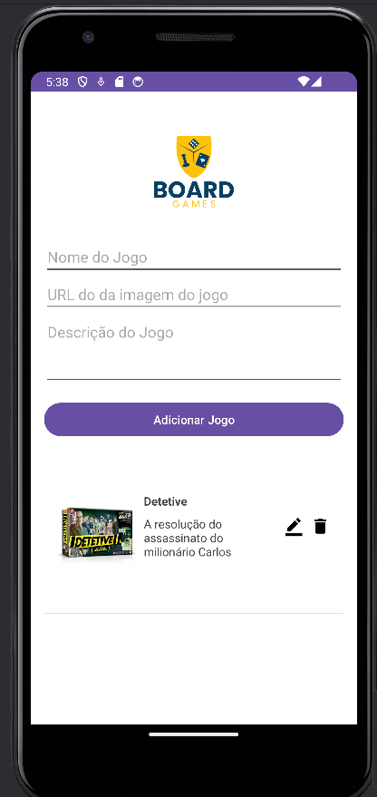

# BoardGames App

O **BoardGames App** é uma aplicação Android para gerenciar uma coleção de jogos de tabuleiro. Ele permite adicionar, visualizar, editar e excluir jogos, armazenando os dados localmente usando o Room Database.

## Funcionalidades

- **Adicionar Jogo**: Insira o nome, URL da imagem e descrição para adicionar um novo jogo à lista.
- **Visualizar Jogos**: Veja a lista completa dos jogos adicionados com suas respectivas imagens e descrições.
- **Editar Jogo**: Atualize as informações de um jogo existente.
- **Excluir Jogo**: Remova um jogo da sua coleção.

## Tecnologias Utilizadas

- **Kotlin**: Linguagem de programação principal.
- **Android Architecture Components**: ViewModel e LiveData para gerenciar dados do UI.
- **Room Database**: Persistência de dados local.
- **Glide**: Carregamento e exibição de imagens a partir de URLs.

## Estrutura do Projeto

- `BoardGame`: Entidade que representa um jogo de tabuleiro.
- `BoardGameDao`: Interface DAO para manipulação dos dados no banco.
- `BoardGameDatabase`: Classe que fornece a instância do banco de dados.
- `BoardGameRepository`: Abstrai o acesso aos dados e gerencia operações CRUD.
- `MainActivity`: Principal atividade que exibe a lista de jogos.
- `MainViewModel` e `MainViewModelFactory`: Gerencia a UI-related data no ciclo de vida do app.
- `MainListAdapter`: Adapter para gerenciar a exibição dos dados em uma RecyclerView.

## Instalação

1. **Clone o repositório**:

   ```bash
   git clone https://github.com/igorkoppen/boardgames.git
   ```

2. **Abra o projeto no Android Studio**.

3. **Compile e rode o app** em um dispositivo ou emulador Android.

## Captura de Tela


